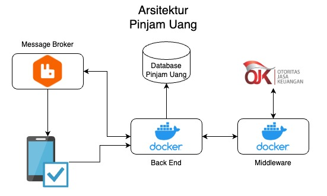
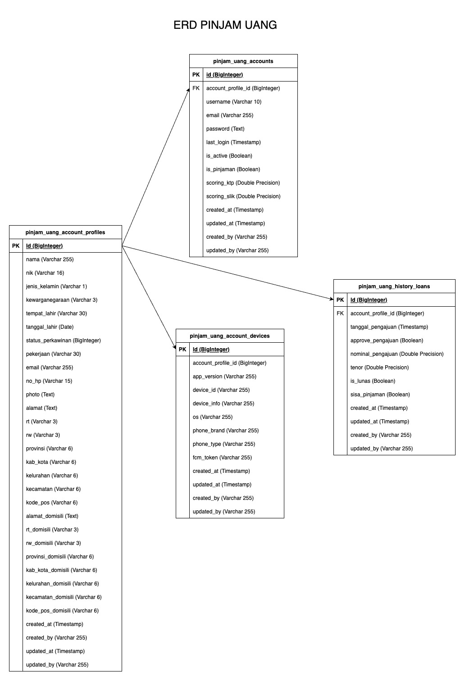
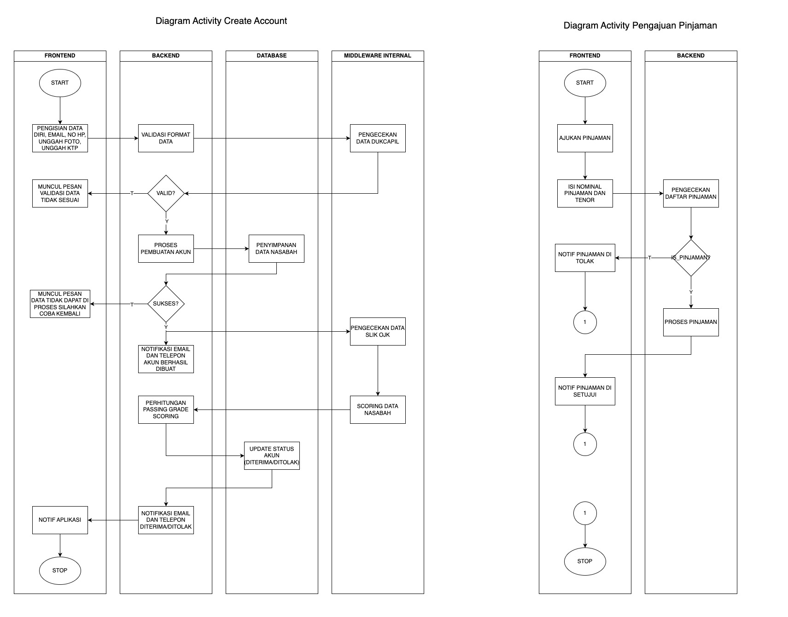

# ARSITEKTUR HIGH LEVEL

## ERD

## ACTIVITY DIAGRAM

## SCREEN FLOW APPS

- Halaman Login  
    

- Halaman berikut merupakan halaman yang akan tampil pertama kali ketika proses registrasi  
    

- Halaman berikut merupakan halaman untuk mengambil foto KTP  
    

- Setelah mengambil foto KTP maka nasabah bisa melihat hasil foto KTP jika dirasa gambar blur atau tidak terlihat jelas dapat mengulangi tahapan untuk mengambil foto KTP  
    

- Setelah pengambilan foto KTP maka akan di proses autofill field-field pada halaman registrasi dengan menggunakan metode OCR  
    

- Setelah Proses login maka akan diarahkan ke halaman utama seperti berikut ini  
    
